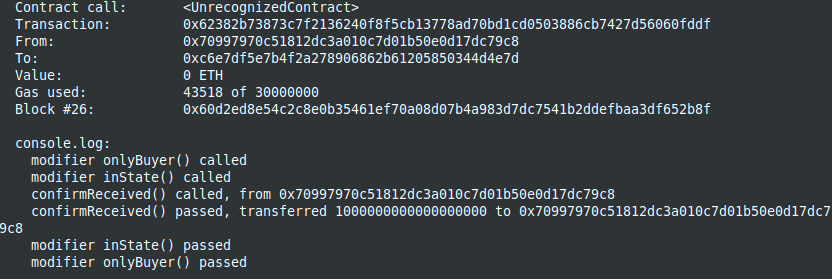

Study case for the Safe Remote Purchase, from The Solidity documentation [Solidity documentation Safe Remote Purchase](https://docs.soliditylang.org/en/latest/solidity-by-example.html#safe-remote-purchase)

I use brownie to compile and deploy into hardhat in order to have the console.log feature.
You should start the hardhat node in another terminal and folder (`hh node`), then, in a terminal :

```
brownie compile
brownie run scripts/deploy.py
```

It demonstrate the use of Enums for locking a contract state with the modifiers.

After deploying from brownie :


The result in the hardhat console :


